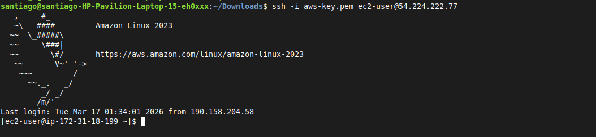
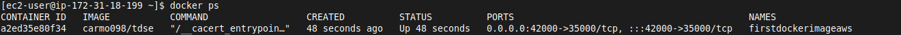
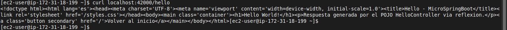
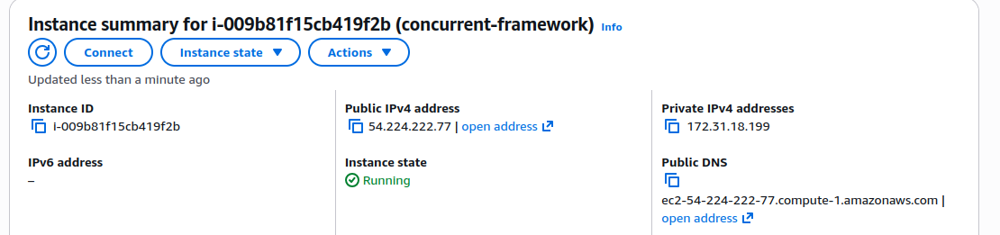
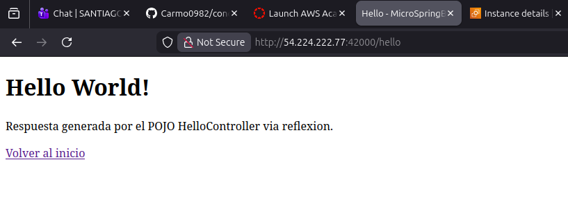

# Concurrent Microframework

Microframework concurrente en Java para exponer endpoints HTTP de forma ligera, con soporte de ejecucion local y despliegue en contenedores Docker.

## Primeros Pasos

Estas instrucciones te permitiran obtener una copia del proyecto y ejecutarla en tu maquina local para desarrollo y pruebas. Consulta la seccion de despliegue para ver notas sobre ejecucion en un entorno productivo.

### Prerrequisitos

Que necesitas instalar y como hacerlo:

```bash
# Java (17 o superior recomendado)
sudo apt update
sudo apt install -y openjdk-17-jdk

# Maven
sudo apt install -y maven

# Docker (opcional, para contenedores)
sudo apt install -y docker.io
```

### Instalacion

Una serie de pasos para dejar el entorno de desarrollo funcionando:

Clona el repositorio:

```bash
git clone <URL_DEL_REPOSITORIO>
cd concurrent-microframework
```

Compila el proyecto:

```bash
mvn clean package
```

Ejecuta la aplicacion localmente:

```bash
mvn exec:java -Dexec.mainClass="org.main.Main"
```

Prueba rapida del endpoint:

```bash
curl "http://localhost:6000/hello"
```

## Ejecucion de pruebas

Asi puedes ejecutar las pruebas automatizadas del sistema:

```bash
mvn test
```

### Pruebas end-to-end

Estas pruebas validan el flujo completo (servidor levantado + peticiones HTTP reales) para comprobar que los endpoints responden como se espera.

```bash
# Ejemplo de validacion E2E manual con curl
curl "http://localhost:6000/hello"
curl "http://localhost:6000/greeting?name=Santiago"
```

### Pruebas de estilo de codigo

Estas pruebas verifican convenciones de calidad y formato para mantener un codigo consistente. Si tienes una herramienta de estilo configurada en tu `pom.xml`, puedes ejecutarla asi:

```bash
# Ejemplo (si Checkstyle esta configurado)
mvn checkstyle:check
```

## Despliegue

### Despliegue de aplicacion Docker en AWS EC2

#### Descripcion

En este laboratorio se desplego una aplicacion web contenida en una imagen Docker dentro de una maquina virtual en AWS.
La aplicacion se ejecuta dentro de un contenedor y se expone a internet mediante el mapeo de puertos.

Tecnologias utilizadas:

* AWS EC2
* Docker
* Imagen Docker publicada en DockerHub

---

### 1. Creacion de la instancia EC2

Se creo una maquina virtual en AWS utilizando el servicio EC2 con la siguiente configuracion:

* **Sistema operativo:** Amazon Linux 2
* **Tipo de instancia:** t2.micro
* **Almacenamiento:** 8 GB
* **Region:** us-east-1

Durante la configuracion se creo un **Security Group** con las siguientes reglas de entrada:

| Tipo       | Puerto | Descripcion                  |
| ---------- | ------ | ---------------------------- |
| SSH        | 22     | Acceso remoto a la instancia |
| Custom TCP | 42000  | Acceso a la aplicacion web   |

---

### 2. Conexion a la instancia

Una vez creada la instancia se accedio mediante SSH usando la llave `.pem` generada en AWS.

```bash
ssh -i key.pem ec2-user@IP_PUBLICA
```



---

### 3. Instalacion de Docker

Dentro de la instancia se instalo Docker ejecutando:

```bash
sudo yum update -y
sudo yum install docker -y
```

Luego se inicio el servicio de Docker:

```bash
sudo service docker start
```

Para evitar usar `sudo` en cada comando se agrego el usuario al grupo docker:

```bash
sudo usermod -a -G docker ec2-user
```

Posteriormente se cerro la sesion y se volvio a conectar para aplicar los cambios.

---

### 4. Ejecucion del contenedor Docker

Se ejecuto un contenedor utilizando la imagen almacenada en DockerHub:

```bash
docker run -d -p 42000:35000 --name firstdockerimageaws carmo098/tdse
```

Explicacion del comando:

* `-d` ejecuta el contenedor en segundo plano.
* `-p 42000:35000` conecta el puerto 42000 de la maquina virtual con el puerto 35000 del contenedor.
* `--name` asigna un nombre al contenedor.
* `carmo098/tdse` es la imagen almacenada en DockerHub.

---

### 5. Verificacion del contenedor

Para verificar que el contenedor se encuentra en ejecucion se utilizo:

```bash
docker ps
```



Tambien se probo el servicio desde la instancia con:

```bash
curl localhost:42000/hello
```



Esto confirmo que la aplicacion estaba funcionando correctamente.

---

### 6. Acceso a la aplicacion

Finalmente, la aplicacion puede accederse desde el navegador usando la IP publica de la instancia:

```text
http://IP_PUBLICA:42000/hello
```

---





### Arquitectura del despliegue

Usuario -> Internet -> AWS EC2 -> Docker Container -> Aplicacion Web

---

### Resultado

La aplicacion se desplego exitosamente en AWS utilizando Docker, permitiendo acceder al endpoint `/hello` desde un navegador web.

## Construido Con

* [Java 21](https://www.oracle.com/java/technologies/downloads/) - Lenguaje y runtime principal del microframework
* [Java Sockets API](https://docs.oracle.com/en/java/javase/21/docs/api/java.base/java/net/package-summary.html) - Implementacion del servidor HTTP concurrente en Java puro
* [Maven](https://maven.apache.org/) - Compilacion y gestion del proyecto
* [Docker](https://www.docker.com/) - Empaquetado y ejecucion en contenedores
* [AWS EC2](https://aws.amazon.com/ec2/) - Infraestructura usada en el despliegue


## Versionado

Se usó [SemVer](http://semver.org/) para versionado.

## Autores

* Santiago Carmona - *Trabajo Inicial* 


## Licencia

Este proyecto se desarrolla en el marco de un curso académico (TDSE) y tiene fines educativos.

## Agradecimientos

* Gracias a quienes compartieron codigo util como referencia
* Inspiracion de la comunidad open source
* Y a todos los que aportan mejoras al proyecto
